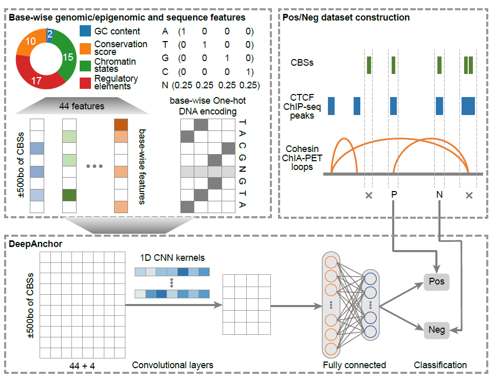

Welcome to LoopAnchor's documentation!
===================================

.. LoopAnchor documentation master file.

LoopAnchor – Inferring CTCF insulators and anchored loops across human tissues and cell types.
=====================================================================================================================================================

Overview
========
CTCF is the most important Transcription Factor (TF) for genomic insulation in vertebrate. But it is also a versatile TF that plays several other roles in transcriptional regulation. Here we present DeepAnchor to provide precise description of the genomic/epigenomic patterns surrounding insulation-related CTCF binding sites (CBSs). Generally, DeepAnchor usees cohesin ChIA-PET data, CTCF ChIP-seq data and CBSs predicted by motif scan as input, to train a classifier to distinguish insulation-related CBSs from others. DeepAnchor then calculates a score ranged from [0, 1] for all CBSs, with a larger value meaning more likely to be a positive CTCF insulator.

Citation
========
Xu, Hang, et al. "Inferring CTCF insulators and anchored loops across human tissues and cell types." bioRxiv (2022).
